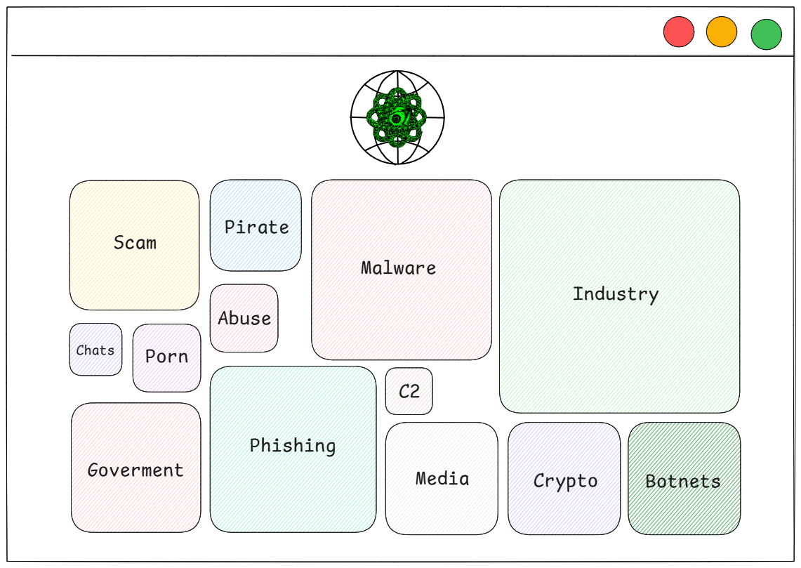

# Ophanim Intelligence Project

## Threat intelligence, cyber intelligence, and cyber defense tool

The following project is a web-based tool that offers investigators a 24/7 proactive information service about domains, URLs, and IP addresses related to malicious, illegal, fraudulent, and unethical activities. It also aims to expose domains from relevant industry sectors such as government, finance, healthcare, education, energy, transportation, and telecommunications. For each domain, WHOIS, GEOIP, DNS, URLs, SSL certificate, HTTP headers, server status, category, and industry classification information will be exposed.

Ophanim Intelligence is based on the concept of the angel "Ophanim," a powerful entity with wheels full of eyes and living, all-seeing spirits. The tool proposes an innovative approach: segmenting the Internet to identify the different resources hosted in the cyber world by category in a clear and centralized manner on a web platform.

---

## Architecture and Project Flow

👉 Frontend (FastAPI + Jinja2)
Analysts access a simple web interface that organizes information hierarchically:
-> Global view grouped by category.
-> Indicators for a specific category.
-> Enriched details of an IOC (domain/IP/URL).

👉 Backend (FastAPI + uvicorn)
Acts as a coordinator: exposes the API for queries and orchestrates worker execution.

👉 Workers (urlHaus, ThreatFox, urlScan + VirusTotal)
Each worker queries external APIs (urlHaus, ThreatFox, urlScan, VT).
Enrich data with AlienVault.
If AlienVault does not respond, they use local tools (curl, openssl, whois, ping, nslookup) to complete the information.

👉 Persistence in MongoDB
Results are saved in MongoDB. Ensures that information is accessible and searchable from the frontend.

👉 TOR Proxy
All external traffic from workers to malicious APIs and domains is routed through TOR (SOCKS5), hiding the system's real IP address.

---

## Web interface concept

